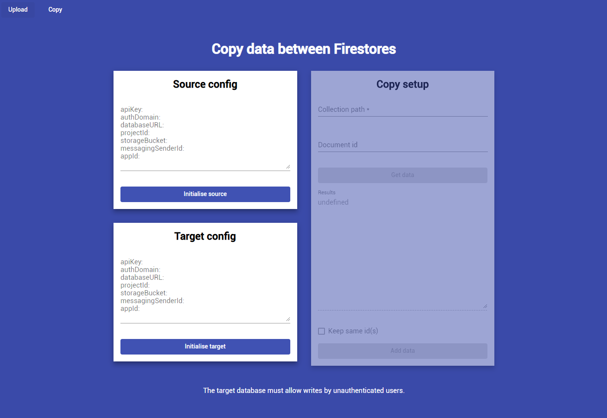

# Firebase Importer

This is a small, quick-and-dirty project that I created to help me:

1. Import JSON data into Firebase
2. Copy data between Firebase databases

## Usage

This is the full source for an Angular app, so you can clone the repo and compile it on your side.

## Limitations

The project has many limitations, including:

1. There are no unit tests
2. There are limited options available for customisation
3. It is not particularly user-friendly
4. It currently requires your database to be insecure to read and write data

However, for my purposes these are shortcomings that I can live with.

## Future plans

At some point, I will add basic login functionality. This should allow you to add data without making your database insecure.

## Merge requests

I'm open to any improvements from the community, so if you would like to add some functionality to the app, please feel free to submit a merge request.
